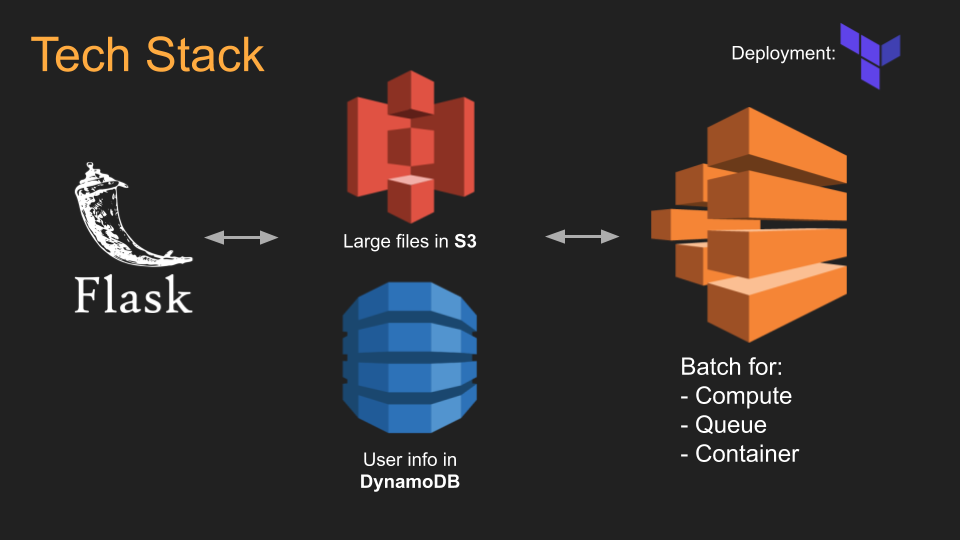

# print-my-brain: Get a 3D print of your brain!

## Project Idea

**To make it easier for people to get a 3D print of their brain, if they have an MRI scan**

User story: As a user, I navigate to a website where I upload an MRI of my brain, and give my email address. A day later, I recieve an email with a link, which allows me to download two .stl files: for my right and left hemisphere. I can also see an image of what my brain looks like. After that, I can take the .stl files to my local makerspace, or use a 3D printing service (shapeways, xometry, etc)  to get a 3D print of my brain.

## Tech Stack
will likely change!

## Data Source

Eventually the users, but for now - Human Connectome Project data is available to be mounted on S3

## Engineering Challenge

Going from the MRI to the .stl is computationally expensive (8h on a typical workstation) - it will need to be in a separate process for each brain. I think it makes sense to launch an instance separately for each brain.

Also, uploading and downloading large files through a web interface may be a challenge

The MRI-to-stl process is largely solved (albeit inefficiently and somewhat unreliably). In a previous hackathon project, I built a docker container to accomplish this (https://github.com/danjonpeterson/brain_printer). You could think of this project as scaling-up and making a public-facing interface to this process.

## Business Value

There are multiple avenues to monetization:  

- Charging the user directly  
- Advertising and/or partnering with 3D printing services  
- Contracting with research labs for rewarding volunteers

## Minimum Viable Product

The application NEEDS to:

- Accept a ~30MB MRI over the web 
- Do the processing in a an EC2 instance launched for each user  
- Serve a link to the two R/L ~8MB .stl files
- Store user info in a database (SQLite)
- Give some QA info - some way to visually inspect the result
- Handle 20 concurrent jobs in a stress-test with the HCP data

## Stretch Goals

- Actually print a brain from a user (typical ~36h print time)
- Automatically delete files after some amount of time (a week?)
- Optimize mesh file size
- Make the database redundant and fault-tolerant over multiple nodes
- Speed up the core process (MRI -> .stl)
- Take some billing and address info to manage the hand-off to 3D printing services
